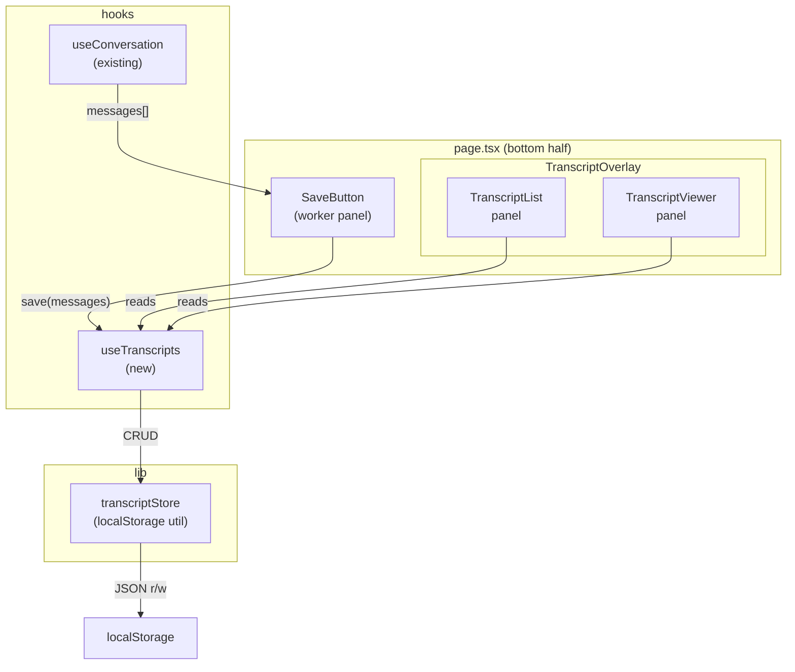

# Design Document: Transcript Save & Review

## Overview

The transcript save and review feature lets workers save a completed conversation to localStorage and browse or re-read past sessions. It is entirely worker-side: nothing is visible to the resident, no backend changes are needed, and no account is required.

The feature slots into the existing split-screen layout by adding a slide-up overlay panel that covers only the **bottom half** (worker side) of the screen. This keeps the resident-facing top half undisturbed and makes the panel trivially dismissible — one tap returns to the live conversation.

### Key Design Decisions

- **localStorage only** — no backend, no auth, no sync. Transcripts live on the device.
- **Overlay on bottom half only** — the resident side is never obscured or affected.
- **Single-tap dismiss** — a persistent ✕ button closes the overlay instantly, satisfying the privacy requirement for shared devices.
- **No title input friction** — titles are auto-generated from the session date/time; the worker can optionally rename later (out of scope for v1).
- **JSON serialization** — transcripts are stored as a JSON array under a single localStorage key, making the store simple and auditable.

---

## Architecture



State flow:
1. Worker taps **Save** → `useTranscripts.save(messages)` → `transcriptStore.add(transcript)` → localStorage.
2. Worker taps **Transcripts** → `TranscriptOverlay` mounts over the bottom half, showing `TranscriptList`.
3. Worker taps a row → `TranscriptViewer` replaces `TranscriptList` inside the overlay.
4. Worker taps ✕ → overlay closes, bottom half returns to live conversation.

---

## Components and Interfaces

### `transcriptStore` (`frontend/lib/transcriptStore.ts`)

Pure utility — no React. All localStorage access is isolated here.

```ts
interface TranscriptStore {
  getAll(): SavedTranscript[];
  add(transcript: SavedTranscript): void;       // throws StorageFullError
  remove(id: string): void;
  clear(): void;
}
```

Errors are thrown as typed classes (`StorageFullError`, `StorageUnavailableError`) so callers can display appropriate messages.

---

### `useTranscripts` hook (`frontend/hooks/index.ts`)

React wrapper around `transcriptStore`. Owns the in-memory list so components re-render on changes.

```ts
interface UseTranscriptsReturn {
  transcripts: SavedTranscript[];
  saveTranscript(messages: TranslationResult[]): SaveResult;
  deleteTranscript(id: string): void;
  storageError: string | null;
  dismissStorageError: () => void;
}

type SaveResult =
  | { ok: true }
  | { ok: false; reason: "empty" | "storage_full" | "unavailable" };
```

`saveTranscript` returns a discriminated union instead of throwing, so the UI can branch on the result without try/catch at the call site.

---

### `SaveButton` (`frontend/components/SaveButton.tsx`)

Rendered inside the bottom half of `page.tsx`, near the worker's mic/text controls. Single icon button (floppy disk or bookmark icon). On tap:
- Calls `useTranscripts.saveTranscript(messages)`.
- Shows inline toast: "Saved" on success, "Nothing to save" if empty, error message if storage full.
- On success, offers a "Clear & start new session" action in the toast.

---

### `TranscriptOverlay` (`frontend/components/TranscriptOverlay.tsx`)

Absolutely-positioned panel that covers the bottom half only (`position: absolute; inset: 0` within `.half`). Contains either `TranscriptList` or `TranscriptViewer` depending on `activeTranscriptId` state.

Props:
```ts
interface TranscriptOverlayProps {
  transcripts: SavedTranscript[];
  onDelete(id: string): void;
  onClose(): void;
}
```

Internal state: `activeTranscriptId: string | null` — null shows the list, a string shows the viewer.

---

### `TranscriptList` (`frontend/components/TranscriptList.tsx`)

Scrollable list of transcript rows. Each row shows title, date, and message count. Tapping a row sets `activeTranscriptId`. A delete button on each row triggers a confirmation dialog before calling `onDelete`.

---

### `TranscriptViewer` (`frontend/components/TranscriptViewer.tsx`)

Chronological message list for a single transcript. Each message shows speaker role, original text, translated text, source language, target language, and time. Worker messages are right-aligned; resident messages are left-aligned (mirroring the existing `MessageBubble` visual language).

---

## Data Models

### `SavedTranscript`

```ts
export interface SavedTranscript {
  /** UUID v4 — assigned at save time */
  id: string;
  /** Auto-generated: "Session – Mon 14 Jul, 09:32" */
  title: string;
  /** Unix ms timestamp of when the transcript was saved */
  savedAt: number;
  /** Copy of the messages array at save time */
  messages: TranslationResult[];
}
```

`TranslationResult` is the existing type from `frontend/types/index.ts` — no changes needed.

### localStorage layout

```
Key:   "hearth_transcripts"
Value: JSON.stringify(SavedTranscript[])
```

A single key holds the full array. On every write the array is re-serialized and the key is overwritten. This keeps the store simple and avoids key-per-transcript fragmentation. Given typical session sizes (tens of messages, each a few hundred bytes), the full array will stay well under localStorage's ~5 MB limit for normal usage; the quota guard handles the edge case.

### Storage size estimate

A single message (`TranslationResult`) serializes to roughly 300–600 bytes. A 50-message session ≈ 25 KB. localStorage quota is typically 5–10 MB, so ~200 sessions before hitting the limit. The quota guard (Requirement 6.1) catches the `QuotaExceededError` and surfaces it to the worker.

---

## Correctness Properties

*A property is a characteristic or behavior that should hold true across all valid executions of a system — essentially, a formal statement about what the system should do. Properties serve as the bridge between human-readable specifications and machine-verifiable correctness guarantees.*

### Property 1: Persistence round-trip

*For any* array of `TranslationResult` messages, saving them via `transcriptStore.add()` and then calling `transcriptStore.getAll()` should return a transcript whose `messages` array is deeply equal to the original input, with all fields (id, speaker, originalText, translatedText, detectedLanguage, targetLanguage, timestamp) preserved.

**Validates: Requirements 1.1, 5.2, 5.4, 5.5**

---

### Property 2: Empty save is rejected

*For any* call to `useTranscripts.saveTranscript([])` (an empty messages array), the result should be `{ ok: false, reason: "empty" }` and `transcriptStore.getAll()` should be unchanged.

**Validates: Requirements 1.2**

---

### Property 3: Saved transcript IDs are unique

*For any* sequence of N save operations, all resulting `SavedTranscript.id` values should be pairwise distinct.

**Validates: Requirements 1.4**

---

### Property 4: Transcript list is reverse-chronological

*For any* collection of saved transcripts with distinct `savedAt` timestamps, `transcriptStore.getAll()` should return them sorted in descending order by `savedAt` (most recent first).

**Validates: Requirements 2.1**

---

### Property 5: List row contains required fields

*For any* `SavedTranscript`, the rendered list row should contain the transcript's title, a human-readable representation of `savedAt`, and the count of messages equal to `messages.length`.

**Validates: Requirements 2.2, 6.2**

---

### Property 6: Viewer messages are chronological

*For any* `SavedTranscript`, the messages rendered by `TranscriptViewer` should appear in ascending order by `timestamp` (oldest first).

**Validates: Requirements 3.1**

---

### Property 7: Viewer message row contains required fields

*For any* `TranslationResult` message rendered inside `TranscriptViewer`, the rendered output should contain the speaker role, the original text, the translated text, the detected source language code, the target language code, and a formatted time string derived from `timestamp`.

**Validates: Requirements 3.2**

---

### Property 8: Delete removes transcript

*For any* saved transcript with id `X`, calling `transcriptStore.remove(X)` and then `transcriptStore.getAll()` should return a list that contains no transcript with id `X`.

**Validates: Requirements 4.2**

---

### Property 9: Storage errors are surfaced without crash (edge case)

*For any* operation (add or remove) where `localStorage` throws (simulated `QuotaExceededError` or `SecurityError`), the store should throw a typed error (`StorageFullError` or `StorageUnavailableError`) and the in-memory state should remain consistent — no partial writes, no uncaught exceptions propagating to the UI.

**Validates: Requirements 5.3, 6.1**

---

### Property 10: Closing overlay preserves conversation

*For any* conversation state (non-empty `messages` array), opening the `TranscriptOverlay` and then closing it should leave the `messages` array from `useConversation` identical to what it was before the overlay was opened.

**Validates: Requirements 7.3**

---

## Error Handling

| Scenario | Detection | User-facing message | Recovery |
|---|---|---|---|
| Save with empty conversation | `messages.length === 0` check in `saveTranscript` | "Nothing to save yet" toast | No-op; conversation continues |
| localStorage quota exceeded | Catch `QuotaExceededError` in `transcriptStore.add` | "Storage full — delete old transcripts to save new ones" toast | Transcript not saved; existing data intact |
| localStorage unavailable (private browsing, security policy) | Catch any error in `transcriptStore` init | "Transcripts unavailable on this device" toast | App continues without persistence |
| Delete fails | Catch error in `transcriptStore.remove` | "Could not delete transcript" toast | List unchanged |
| Corrupted localStorage data | `JSON.parse` throws in `getAll` | "Could not load saved transcripts" toast | Returns empty array; app continues |

All errors are surfaced as non-blocking toasts. The app never crashes or blocks the live conversation.

---

## Testing Strategy

### Dual approach

Both unit tests and property-based tests are required. They are complementary:
- Unit tests cover specific examples, integration points, and error conditions.
- Property tests verify universal correctness across randomized inputs.

### Property-based testing library

Use **[fast-check](https://github.com/dubzzz/fast-check)** (TypeScript, works with Jest/Vitest, well-maintained).

Install: `npm install --save-dev fast-check`

Each property test must run a minimum of **100 iterations** (fast-check default is 100; set explicitly with `{ numRuns: 100 }`).

Each property test must include a comment tag in this format:
```
// Feature: transcript-save-review, Property <N>: <property_text>
```

Each correctness property must be implemented by exactly **one** property-based test.

### Property test sketches

```ts
// Feature: transcript-save-review, Property 1: Persistence round-trip
fc.assert(fc.property(fc.array(arbitraryMessage(), { minLength: 1 }), (messages) => {
  const store = makeStore(mockLocalStorage());
  store.add(makeTranscript(messages));
  const saved = store.getAll()[0];
  expect(saved.messages).toEqual(messages);
}), { numRuns: 100 });

// Feature: transcript-save-review, Property 3: Saved transcript IDs are unique
fc.assert(fc.property(fc.array(fc.array(arbitraryMessage(), { minLength: 1 }), { minLength: 2, maxLength: 20 }), (messageSets) => {
  const store = makeStore(mockLocalStorage());
  messageSets.forEach(msgs => store.add(makeTranscript(msgs)));
  const ids = store.getAll().map(t => t.id);
  expect(new Set(ids).size).toBe(ids.length);
}), { numRuns: 100 });

// Feature: transcript-save-review, Property 4: Transcript list is reverse-chronological
fc.assert(fc.property(fc.array(arbitraryTranscript(), { minLength: 2 }), (transcripts) => {
  const store = makeStore(mockLocalStorage());
  transcripts.forEach(t => store.add(t));
  const result = store.getAll();
  for (let i = 1; i < result.length; i++) {
    expect(result[i - 1].savedAt).toBeGreaterThanOrEqual(result[i].savedAt);
  }
}), { numRuns: 100 });

// Feature: transcript-save-review, Property 8: Delete removes transcript
fc.assert(fc.property(arbitraryTranscript(), (transcript) => {
  const store = makeStore(mockLocalStorage());
  store.add(transcript);
  store.remove(transcript.id);
  expect(store.getAll().find(t => t.id === transcript.id)).toBeUndefined();
}), { numRuns: 100 });
```

### Unit test coverage

Focus unit tests on:
- **`transcriptStore`**: empty-array rejection, corrupted JSON recovery, `QuotaExceededError` handling, `StorageUnavailableError` handling.
- **`TranscriptList`**: empty state renders "no transcripts" message (Requirement 2.3 example).
- **`TranscriptViewer`**: all six message fields present in rendered output for a known fixture.
- **`SaveButton`**: success toast shown, "nothing to save" toast shown for empty conversation.
- **Integration**: opening then closing `TranscriptOverlay` does not mutate `useConversation` messages.

### Test file locations

```
frontend/
  lib/
    transcriptStore.test.ts      ← store unit + property tests
  components/
    TranscriptList.test.tsx      ← list rendering unit tests
    TranscriptViewer.test.tsx    ← viewer rendering unit tests
    SaveButton.test.tsx          ← save action unit tests
  hooks/
    useTranscripts.test.ts       ← hook integration tests
```
