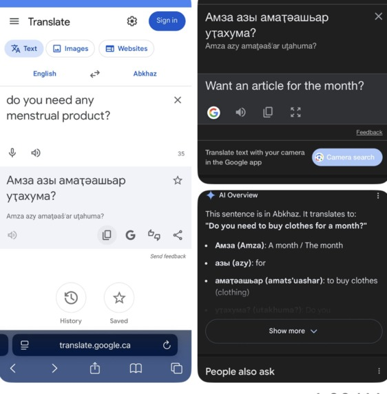
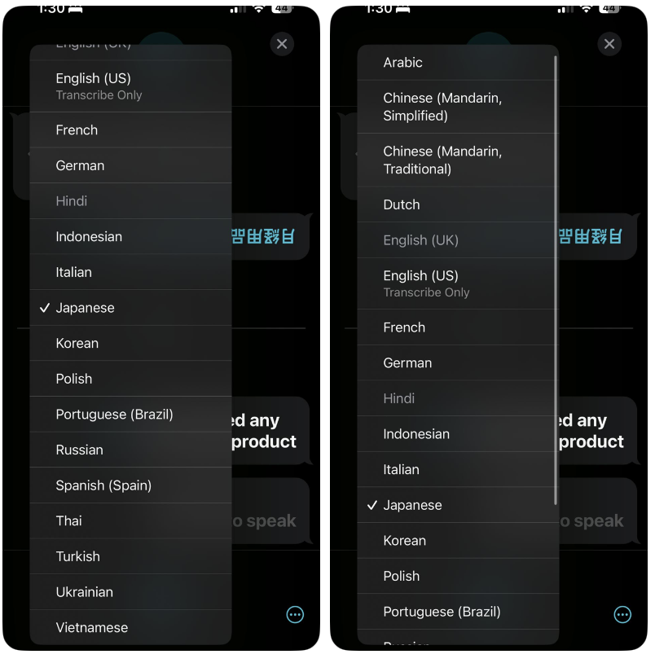
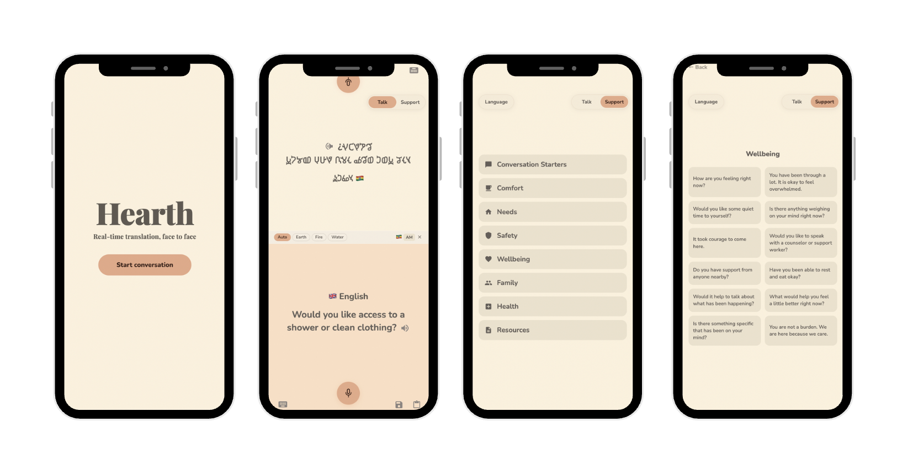
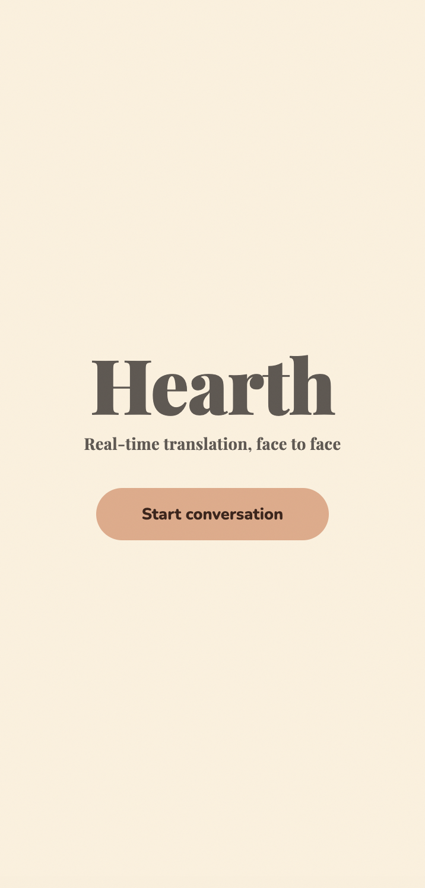
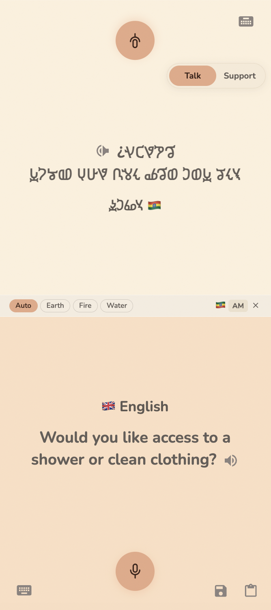
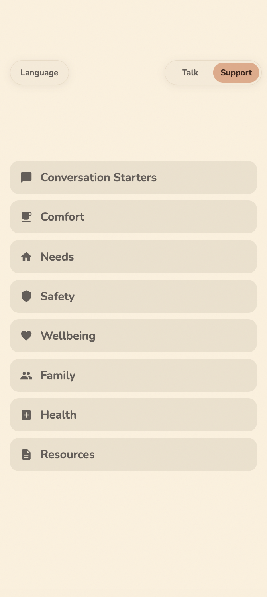
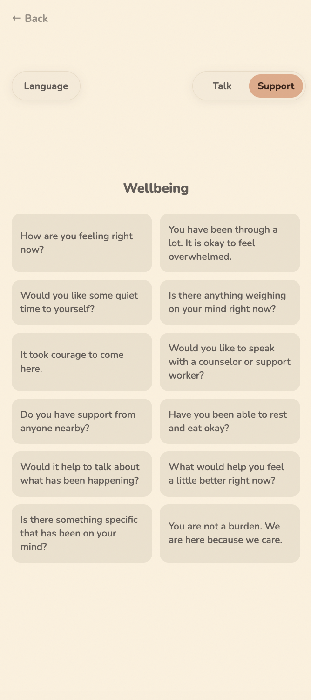
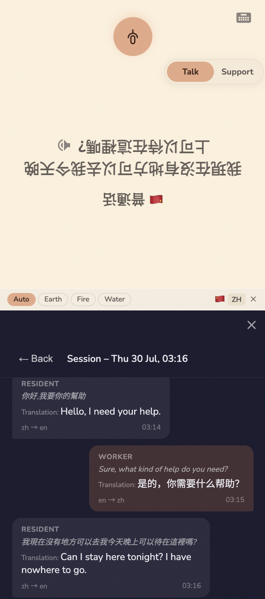
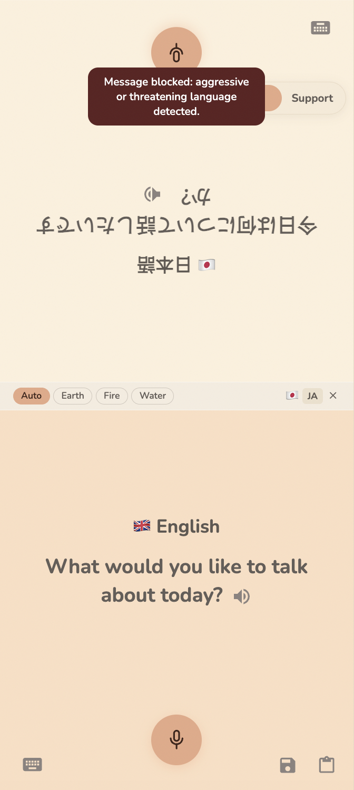
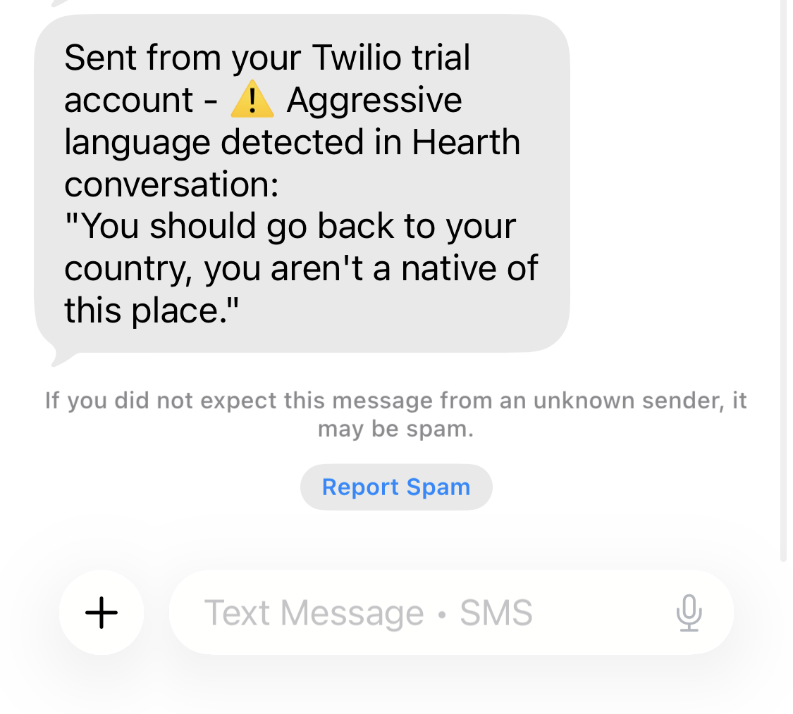

<h1 align="center">Hearth</h1>
<h2 align="center">(youCode 2026)</h2>

<h4 align="center">
  A multilingual communication tool for women's shelters that leaves no one behind.
</h4>

<p align="center">
  🏆 1st Place in the Community Women's Initiative (CWI) Experienced Stream<br>
  🥇 Diversity in CS Project Hub Winner
</p>

<p align="center">
  
</p>

<p align="center">
  <a href="https://devpost.com/software/hearth-pvngm3">Devpost</a>
</p>

<br>

## Table of Contents
- [Contributors](#contributors)
- [Problem Statement](#problem-statement)
- [Overview](#overview)
- [User Flow](#user-flow)
- [Features](#features)
- [Tech Stack](#tech-stack)
- [How It Works](#how-it-works)
- [Technical Challenges](#technical-challenges)
- [Achievements](#achievements)
- [What We Learned](#what-we-learned)
- [Future Improvements](#future-improvements)
- [Getting Started](#getting-started)

<br>

## Contributors
- Jasmine Zou
- Jianding Bai
- Stephanie Xue
- Yuko Murayama

<br>

## Problem Statement

Emily and Jarny work at the front desk of The Bloom Group, a low-barrier women's shelter in Vancouver. When we called them, we expected to hear about challenges such as access to shelter housing, mental health counselling, or digital resources. Instead, the most immediate need they identified, and the first thing Emily mentioned when we asked what would make her job easier, was interpreters.

For women in shelters, communication is not just a matter of convenience. It is directly tied to safety and access to care. Many residents are navigating crisis situations such as domestic violence, housing instability, or displacement, often while managing emotional stress or trauma, or caring for children. In these moments, the ability to clearly express needs and understand available support is critical.

However, many women's shelters serve individuals from diverse linguistic and cultural backgrounds. Language barriers can make already difficult situations even more isolating. When communication breaks down, it affects everything from intake and safety planning to accessing resources and receiving emotional support.

Through our conversations with staff at The Bloom Group, we identified a clear and urgent need for a more reliable and accessible communication solution.

Shelter staff shared that:
- Language barriers are a daily challenge, especially among residents from diverse backgrounds, including refugees and immigrants
- Existing tools such as Google Translate are often unreliable in real-world scenarios
- Many languages, particularly African and Middle Eastern languages, are poorly supported
- Shelters often lack the resources to hire professional interpreters
- In some cases, staff are unable to identify which language a resident is speaking

<table align="center">
  <tr>
    <td align="center" width="50%">
      <br>
      <em>
        Google Translate output showing how inaccurate translations can distort meaning in sensitive or context-dependent conversations, leading to confusion and miscommunication.
      </em>
    </td>
    <td align="center" width="50%">
      <br>
      <em>
        Google Translate interface highlighting limited language options, which can exclude low-resource and underserved language communities.
      </em>
    </td>
  </tr>
</table>

Beyond our interviews, data reinforces the scale of the issue:
- Around 45% of women's shelter residents are non-native English speakers
- About 87% have low to medium digital literacy

These constraints mean that most existing solutions are not designed for real women's shelter environments. When communication fails, people may struggle to access women's shelter spaces and essential services, mental health support becomes harder to deliver, and residents can feel less safe, less understood, and less empowered.

<br>

## Overview

Most translation tools were built for the world's dominant languages. Hearth was built for the ones left out.

Hearth is a full-stack mobile communication and translation tool designed for women's shelter residents and staff. It is built as a Progressive Web App (PWA) with Next.js, React, TypeScript, and CSS on the frontend and FastAPI and Python on the backend. When a resident speaks, OpenAI's Whisper, a multilingual speech recognition model that runs locally on-device, first detects the spoken language and then transcribes the speech into text. The transcribed text is then translated using Cohere's Tiny Aya, a family of multilingual translation models that also supports local deployment and is optimized for low-resource languages such as Amharic, Hausa, and Swahili. The translated text can be read aloud through the browser's Web Speech API, which can also support voices built directly into the device. Harmful language detection is run continously in the background, sending an SMS alert to staff through the Twilio API if harmful langauge is detected to support timely follow-up and de-escalation. Conversations can also be saved as transcripts in local storage, letting residents and staff revisit or delete past sessions directly on-device to help protect their privacy. Rather than acting as a one-way translator, Hearth functions as a low-friction communication layer that enables real-time, two-way conversations between shelter residents and staff.

### Core Features
- Real-time, two-way communication through a voice-to-text-to-translation-to-speech pipeline
- Automatic language detection, so conversations can begin even when the spoken language is unknown
- Broad coverage of 70+ languages, including many underserved, low-resource languages
- Four selectable translation models, each optimized for a different language group (Auto, Earth, Fire, and Water)
- Flexible voice or text input, so residents and staff can choose what works best
- Guided conversation prompts tailored to women's shelter environments and conversations
- A low-friction, intuitive interface that requires little to no training

### Designed for Privacy and Safety
- Built for shared-device use in low-resource shelter environments
- Speech-to-text, translation, and text-to-speech models and services can all support local deployment
- No account creation is required and transcripts are stored on-device to reduce barriers and protect user privacy
- Harmful language detection that alerts shelter staff by SMS, supporting timely response and de-escalation

Minimizing dependency on external services was a key design principle. OpenAI's Whisper can run locally to handle speech recognition and language detection, keeping audio on the device. Cohere's Tiny Aya can likewise support local deployment for translation, while remaining well suited to underserved and low-resource languages. The browser's Web Speech API can support voices built directly into the device for audio playback. Conversation transcripts can also be kept in local storage rather than on an external server, keeping data on-device.

### Beyond Translation: Thinking About Empowerment
- Enabling residents to communicate their needs, concerns, and experiences more clearly
- Supporting staff to ask more effective, context-aware questions
- Creating space for meaningful communication beyond simple information exchange

<br>

## User Flow

Starting from the landing screen, a shelter resident or staff member can open the translation screen to begin the conversation by speaking or typing. Each message is converted to text, translated into the other person's language, and played back as speech, allowing the conversation to continue back and forth in real time. Users can also switch to a different translation model variant to better match the languages involved, open the support screen for guided prompts to help navigate sensitive conversations, and review saved exchanges in the conversation transcript. Harmful language detection runs continuously in the background, sending an SMS alert to shelter staff through Twilio to support timely follow-up and de-escalation.

<p align="center">
  
</p>

<br>

## Features

### Landing Screen
Welcomes users with a simple, intuitive landing screen that requires no login or setup, giving residents and staff a quick way to move into the translation screen and begin a conversation.

<p align="center">
  
</p>

<br>

### Translation Screen
A voice-to-text-to-translation-to-speech pipeline powers real-time, two-way communication between residents and staff. On either side of the screen, users can press and hold the voice input button to speak in any language, or switch to a keyboard option to type instead. Once a message is spoken or typed, the language is automatically detected and translated without requiring any manual selection, and the translated text appears on screen with an option to play the translated speech aloud. This exchange can continue back and forth in real time, letting the conversation flow naturally on both sides. Users can also select a translation model variant, each optimized to support a different language group, as shown below:
- **Auto**: Automatically selects the most appropriate model based on the detected language
- **Earth**: West Asian and African languages
- **Fire**: South Asian languages
- **Water**: European and Asia-Pacific languages

<p align="center">
  
</p>

<br>

### Support Screen
Provides categorized prompts tailored to women's shelter environments, helping staff navigate sensitive conversations. Before selecting a prompt, users can choose a language from the dropdown menu and then pick a category from the list below:
- **Conversation Starters**: Open-ended questions to begin a conversation and invite a resident to share
- **Comfort**: Reassuring phrases to help a resident feel safe, supported, and unhurried
- **Needs**: Questions about immediate needs such as food, shelter, hygiene, and rest
- **Safety**: Questions to assess immediate danger and confirm a resident feels safe
- **Wellbeing**: Questions checking in on emotional and mental wellbeing
- **Family**: Questions about children or family members who may need support
- **Health**: Questions about physical health, pain, medication, and medical care
- **Resources**: Prompts covering housing, legal services, case work, and other support options

<p align="center">
  
</p>

<br>

### Prompt Screen
Displays predefined prompts within the selected category. Selecting a prompt translates it into the chosen language, and users can use the speaker icon to play the translated speech aloud if the language is supported.

<p align="center">
  
</p>

<br>

### Conversation Transcript
Enables users to save a conversation as a transcript, stored locally rather than on an external server. Saved transcripts are organized into individual sessions, allowing residents and staff to review a session's full message history at any time or delete it when it is no longer needed.

<p align="center">
  
</p>

<br>

### Harmful Language Detection and Alert
Each translation is automatically screened for harmful language before it is delivered. When harmful language is detected, the translation is blocked, an in-app alert is displayed, and an SMS alert is sent to the configured phone number so staff can quickly respond and de-escalate the situation.

<p align="center">
  
  &nbsp;&nbsp;&nbsp;&nbsp;&nbsp;&nbsp;&nbsp;&nbsp;
  
</p>

<br>

## Tech Stack

| Layer | Technology |
|---|---|
| Frontend | Next.js, React, TypeScript, and CSS, built as a Progressive Web App (PWA) |
| Backend | FastAPI, Python |
| Speech-to-Text | Whisper by OpenAI (AI transcription model that detects language and converts speech to text) |
| Translation | Tiny Aya by Cohere (AI multilingual translation model optimized for low-resource languages) |
| Text-to-Speech | Web Speech API (converts translated text to speech using built-in voices) |
| SMS Alerts | Twilio API (sends SMS alerts when harmful language is detected) |
| Database | Local storage (retains conversation transcripts locally on-device) |

<br>

## How It Works

### Language Detection and Transcription (Speech-to-Text)
When a resident speaks, the recorded audio is sent to the backend, where OpenAI's Whisper, an AI transcription model that runs locally on-device, detects the spoken language and transcribes the audio into text in a single pass, returning both the transcript and a language code. When a user types a message instead of speaking, no language is known yet, so language detection is deferred until the translation step. The backend exposes separate endpoints for speech processing, for translating a resident's message into English, and for translating a staff member's English reply back into the resident's language.

### Translation
The transcribed or typed text is then sent to Cohere's Tiny Aya, an AI multilingual translation model that covers 70+ languages with a focus on low-resource languages such as Amharic, Hausa, and Swahili. The model is currently accessed through the Hugging Face Inference API due to time and resource constraints, though it can also be downloaded and run locally. One of four Tiny Aya model variants can be chosen (Auto, Earth, Fire, or Water), each fine-tuned for a different language group. If the language was not already detected during speech processing, Aya is prompted to both detect the language and translate the text in the same request. If it was already known, Tiny Aya is only asked to translate. The model is prompted to return only the translated text with no extra commentary, and the backend strips out any leftover labels it occasionally still includes before returning the result to the frontend.

### Speech Synthesis and Playback (Text-to-Speech)
The translated text can be played as speech using the browser's Web Speech API. Voice availability, and whether a voice works offline, depend on the browser and operating system. Available voices are matched against the target language code, preferring a natural-sounding voice when multiple options are available. Tapping the speaker icon next to a translated message triggers playback, giving residents and staff a way to follow the conversation by ear as well as by text.

### Harmful Language Detection
Before any translation reaches the other person, the English version of the text is checked against a broad list of keywords and harmful phrases. If harmful language is detected, the translation is blocked from being delivered, an in-app alert is displayed, and the backend sends an SMS alert through the Twilio API to the configured phone number so staff can quickly respond and de-escalate the situation.

### Guided Prompts
On the support screen, a user first selects a language from a list of 70+ options, then chooses a category to reveal a set of predefined prompts written for women's shelter conversations. Selecting a prompt sends it through the same translation pipeline used elsewhere in the app, translating the phrase into the resident's language without the staff member needing to type or speak it themselves. The translated phrase can then be played aloud using the speaker icon if the language is supported. A language must be selected before a prompt can be used.

### Conversation Transcript
Users can save a completed conversation as a transcript directly in the browser's local storage rather than on a server. Each saved transcript is kept as its own session, listed with the most recent first, so residents and staff can reopen a session to review its messages or delete it once it is no longer needed.

<br>

## Technical Challenges

- Balancing privacy and functionality by selecting models and services that support local deployment wherever possible while maintaining reliable performance
- Integrating multiple AI models across the voice-to-text-to-translation-to-speech pipeline into a single, cohesive real-time system
- Ensuring speech-to-text, translation, and text-to-speech systems perform reliably across diverse languages
- Designing for low digital literacy, ensuring the interface remains intuitive and requires minimal training

<br>

## Achievements

- Built a privacy-first system that uses models and services that support local deployment, avoids account creation, and stores transcripts locally
- Integrated multiple AI components, for speech-to-text, translation, and text-to-speech, into a unified real-time experience
- Designed for real-world edge cases often overlooked by existing tools, including low digital literacy, limited context, and diverse language needs
- Made intentional product and technical decisions to ensure the solution is practical, accessible, and deployable in real women's shelter environments

<br>

## What We Learned

- Recognized that the challenges faced by women in shelters extend beyond access to information, shaped by communication, trust, and day-to-day constraints that affect how they seek help, access services, and interact with staff
- Explored new technologies and AI models, including Tiny Aya by Cohere and Whisper by OpenAI, applying them in a real-world system to support multilingual communication
- Developed the ability to evaluate and combine AI models based on their strengths for translation, speech recognition, and multilingual support, ensuring they work effectively together
- Strengthened collaboration skills by integrating, debugging, and refining multiple AI components as a team

<br>

## Future Improvements

Several potential enhancements could extend the functionality of the application:
- Conducting an ethics-focused study on deploying AI in sensitive, real-world environments
- Fine-tuning models with trauma-informed language, women's shelter-specific terminology, and improved handling of sensitive topics
- Expanding safety guardrails with a more context-aware approach to detecting harmful language, beyond keyword matching
- Supporting code-switching to better reflect real-world multilingual communication
- Introducing new interaction modes, including one-to-many "townhall" and broadcast-style communication
- Continuing to test directly with women's shelters like The Bloom Group to gather real user feedback
- Improving deployment in low-connectivity environments to ensure consistent and reliable performance

<br>

## Getting Started

Follow the steps below to set up and run the application on your own machine. This project requires both a frontend and a backend server running at the same time.

<br>

**Prerequisites**

Make sure Node.js, npm, Python 3, and ffmpeg are installed before you begin. You can check the first three by running the commands below, which should each print a version number.
> **Note:** This project requires Node.js 18.18+, per Next.js 15's supported versions. It also requires Python 3.10–3.13, since torch 2.9.1 doesn't support Python 3.14+ yet.
```bash
node --version
npm --version
python3 --version  # On Windows use: python --version
```

ffmpeg can be installed with:
```bash
brew install ffmpeg      # macOS
sudo apt install ffmpeg  # Linux (Debian/Ubuntu)
choco install ffmpeg     # Windows (via Chocolatey)
```

<br>

**1. Clone the Repository**

This downloads a copy of the project to your computer and moves you into the project folder.
```bash
git clone https://github.com/steph-xue/hearth.git
cd hearth
```

**2. Set Up Environment Variables**

Create a `.env` file inside the `backend` folder with your Hugging Face token.
```bash
HF_TOKEN=your_huggingface_token_here  # Hugging Face token
```

**3. Set Up the Backend**

From the project root, move into the backend folder and create a Python virtual environment.
```bash
cd backend
python3 -m venv .venv       # On Windows use: python -m venv .venv
source .venv/bin/activate   # On Windows use: .venv\Scripts\activate
```

Install all of its dependencies and start the backend development server.
```bash
pip install -r requirements.txt
uvicorn app.main:app --reload --host 0.0.0.0 --port 8000
```

**4. Set Up the Frontend**

In a separate terminal window from the project root, move into the frontend folder, install all of its dependencies, and start the frontend development server.
```bash
cd frontend
npm install
npm run dev
```

Once both servers are running, open the local frontend URL displayed in the terminal to start the application.

<br>

### Testing on a Physical Mobile Device

Make sure the backend and frontend servers from the setup steps above are already running before testing on a physical device. The steps differ depending on whether you're testing on iOS or Android.

<br>

**iOS Device**

iOS requires HTTPS for microphone access in the browser, so testing on an iPhone requires a secure tunnel through a tool like ngrok. The frontend proxies all backend calls through its own server (see `frontend/app/api/translate/`), so only the frontend needs to be tunneled, while the backend stays local.

**1. Install ngrok**

ngrok creates a secure HTTPS tunnel to your local frontend server so it can be reached from your iPhone. Alternatively, download the installer directly from [ngrok.com/download](https://ngrok.com/download).
```bash
brew install ngrok        # macOS
sudo snap install ngrok   # Linux (Snap)
choco install ngrok       # Windows (via Chocolatey)
```

**2. Configure Your Authtoken**

Sign up for a free account at [ngrok.com](https://ngrok.com), then copy your authtoken from the dashboard and configure it locally to link the CLI to your account.
```bash
ngrok config add-authtoken YOUR_TOKEN
```

**3. Start a Tunnel**

With both servers already running, start a tunnel that forwards traffic to port 3000, where the frontend is running. Only the frontend needs to be tunneled, since it proxies backend requests through its own API routes.
```bash
ngrok http 3000
```

**4. Find the Tunnel URL**

Once the tunnel starts, ngrok prints a public HTTPS URL that maps to your local server. Look for the `Forwarding` line in the terminal output, for example:
```
Forwarding    https://abcd-1234.ngrok-free.app -> http://localhost:3000
```

**5. Open on Your iPhone**

Copy the `https://...ngrok-free.app` URL from the `Forwarding` line and open it in any browser on your iPhone. Since it's served over HTTPS, microphone access works the same as it does when testing locally.

<br>

**Android Device**

Android devices do not require ngrok and can open the frontend directly over your local network at `http://YOUR_LOCAL_IP:3000`.
